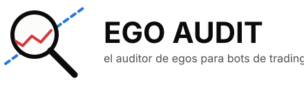
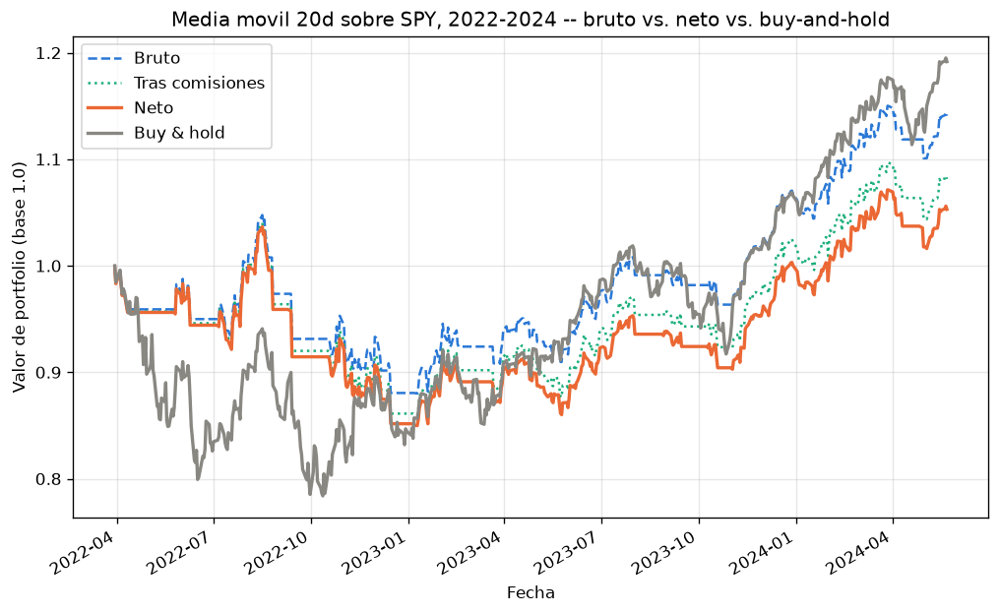

**El auditor de egos para bots de trading.**

Ego Audit audita estrategias de trading escritas en Python: las ejecuta en un sandbox aislado sobre datos históricos gratuitos, aplica walk-forward validation, y desglosa la rentabilidad bruta hasta neta (comisiones + slippage estimado) frente a un benchmark buy-and-hold.

No predice el mercado ni compite con él. Expone honestamente cuánto de la rentabilidad "de laboratorio" de una estrategia sobrevive al contacto con la realidad: overfitting, fricción de ejecución, validación fuera de muestra.

## Un ejemplo real

Media móvil de 20 días sobre SPY, 2022–2024 — una estrategia razonable, nada de paja:



| | Bruto | Tras comisiones | Neto | Buy & hold |
|---|---|---|---|---|
| Resultado | **+14,1%** | +8,1% | **+5,3%** | **+19,2%** |

Bruto parece decente. Tras comisiones y slippage se queda en una cuarta parte de eso. Y aun así pierde contra no hacer absolutamente nada. Esa es la pregunta que Ego Audit hace por ti antes de que te la haga el mercado.

> Proyecto en desarrollo activo. `pip install -e .` ya instala el comando `ego-audit` de verdad — ver Estado más abajo.

## Instalación (desarrollo)

```bash
pip install -e .
ego-audit run mi_estrategia.py --ticker AAPL --start 2023-01-01 --end 2024-01-01
```

Requiere [Docker](https://docs.docker.com/get-docker/) instalado y en el PATH — es donde se ejecuta la estrategia de forma aislada. Sin Docker, `ego-audit run` falla con un mensaje explicándolo, no con un error críptico.

## Para quién es esto

Perfil tech/dev que construye (o quiere construir) bots de inversión en bolsa o cripto, y que sobrevalora los resultados de backtests ingenuos.

## Qué hace (v1.0.0)

1. **Input**: un script Python con una función `estrategia(datos) -> señales`.
2. **Datos**: histórico diario gratuito vía yfinance — S&P 500 como benchmark + un puñado de tickers populares. No intraday, no todo el mercado.
3. **Sandbox aislado**: contenedor Docker efímero, sin red saliente, límites estrictos de CPU/memoria/tiempo, filesystem read-only salvo el directorio de trabajo. Ejecuta código arbitrario de terceros, así que el aislamiento es la prioridad de diseño, no un detalle.
4. **Walk-forward validation**: ventanas deslizantes (ajuste en un periodo, validación en el periodo inmediatamente posterior) para separar rendimiento in-sample de out-of-sample.
5. **Output**: desglose bruto → menos comisiones → menos slippage estimado → neto, comparado contra buy-and-hold del S&P 500 en el mismo periodo.

## Qué NO hace (fuera de alcance en v1)

- Intraday o multi-asset amplio.
- Ejecutar órdenes reales — esto audita, no es un broker.
- Leaderboard social entre estrategias de distintos usuarios.
- Optimización automática de hiperparámetros (induciría el mismo overfitting que la herramienta existe para exponer).

## Estado

En desarrollo activo, por fases:

- [x] **Arquitectura decidida** — contrato de `estrategia()`, motor de contabilidad (Rust + PyO3), estructura del sandbox.
- [x] **Sandbox de ejecución aislada** — Docker con hardening (sin red saliente, límites de CPU/memoria, filesystem read-only, sin privilegios).
- [x] **Capa de datos** — descarga vía yfinance, universo de tickers, cache local, alineación de fechas entre tickers.
- [x] **Walk-forward validation** — ventanas deslizantes + motor de contabilidad en Rust, verificado de principio a fin.
- [x] **Modelo de comisiones y slippage** — bruto → neto ya calculable sobre datos reales.
- [x] **Output visual** — reporte HTML autocontenido con el desglose bruto → neto vs. buy-and-hold. Probado con un ejemplo real (media móvil 20d sobre SPY, 2022-2024): bruto +14%, neto +5%, buy-and-hold +19% — exactamente el tipo de resultado que la herramienta existe para exponer.
- [x] **CLI** — `ego-audit run`, instalable de verdad vía `pip install -e .`. Probado con una ejecución real (ticker AAPL): llega hasta el sandbox y falla con un mensaje claro si no hay Docker, no con un traceback.
- [x] **Lanzamiento** — README con el gancho real (arriba del todo), LICENSE, instrucciones de instalación y contribución.

El pipeline completo (datos → sandbox → walk-forward → costes → output) ya funciona de principio a fin con datos reales, instalado como cualquier paquete de pip.

## Líneas futuras (v2, no v1)

Ideas anotadas a propósito, no construidas todavía — cada una tiene una razón concreta para esperar, no es solo "no ha dado tiempo":

- **Leaderboard social + AIAYN-score** — un ranking público de estrategias por puntuación. Tentador como gancho, pero exige ejecutar código de terceros de forma centralizada (reabre el modelo de amenaza multi-inquilino que v1 evita a propósito) y, sin eso, sería un autoinforme sin verificar — fácil de inflar, irónico para una herramienta que audita honestidad.
- **Dashboard web interactivo** — v1 se queda en reporte estático (HTML/imagen) para no necesitar servidor ni backend.
- **Aislamiento más fuerte del sandbox (gVisor)** — v1 usa Docker con hardening en capas, sin gVisor, para no exigir WSL2/Docker Engine nativo a quien mantiene o instala el proyecto. Se reabre si el proyecto gana tracción real.
- **Ejecución client-side (Pyodide/WASM)** — eliminaría el riesgo de infraestructura del sandbox por completo, a cambio de restringir qué librerías Python puede usar quien escribe la estrategia.
- **Optimización automática de hiperparámetros** — deliberadamente descartada, no solo pospuesta: induciría el mismo overfitting que la herramienta existe para exponer.

## Contribuir

```bash
git clone https://github.com/AIAYN-creator/Ego-Audit.git
cd Ego-Audit
pip install -e ".[dev]"
pytest -m "not slow"   # rapido, sin red real
pytest -m slow         # incluye llamadas reales a yfinance y al motor Rust
pytest                 # todo lo anterior junto -- lo que necesita Docker se salta solo
```

PRs bienvenidas. Antes de mandar una: que los tests pasen, y si añades algo no obvio, que quede documentado el *por qué*, no solo el qué — es el estilo que sigue todo el proyecto.

## Licencia

MIT — ver [LICENSE](LICENSE).
